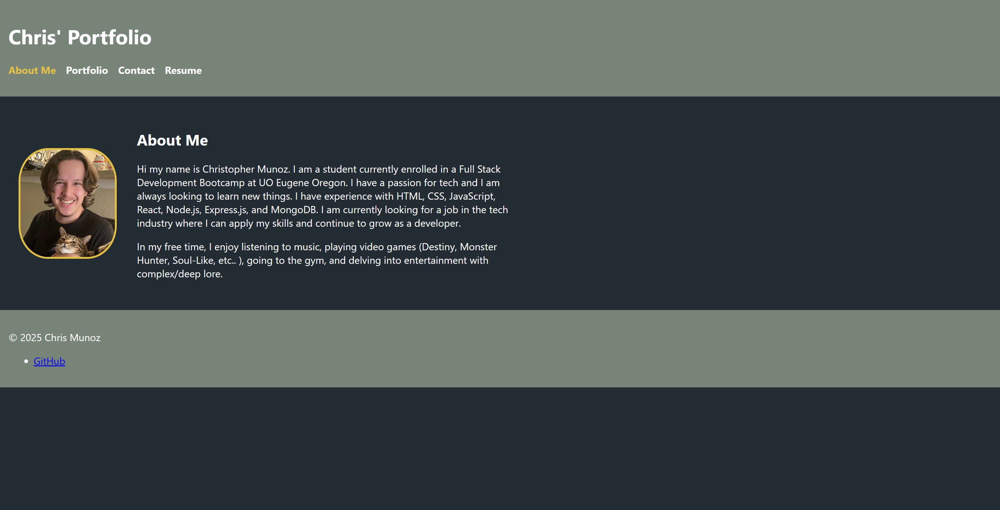
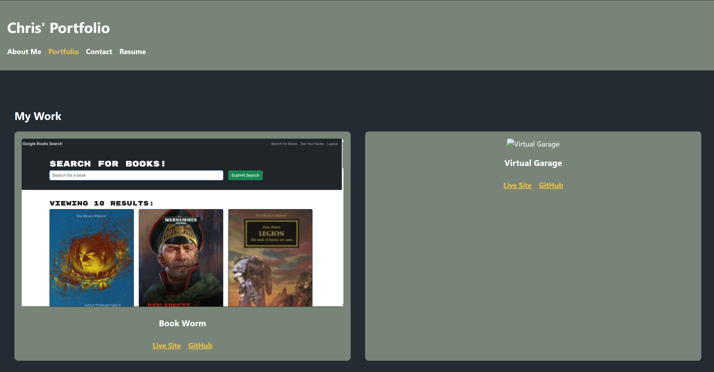
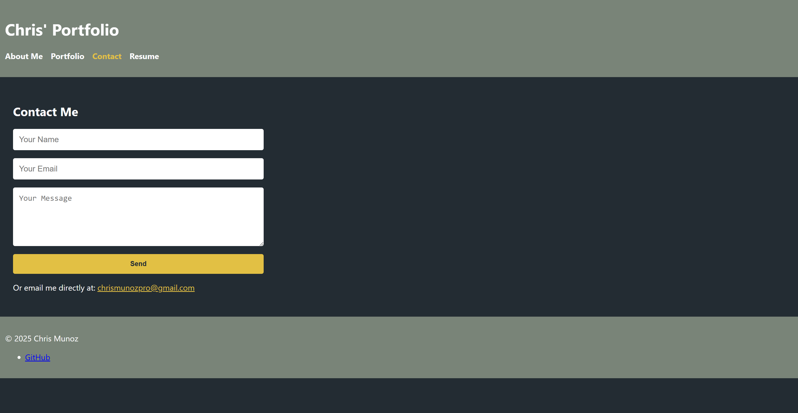
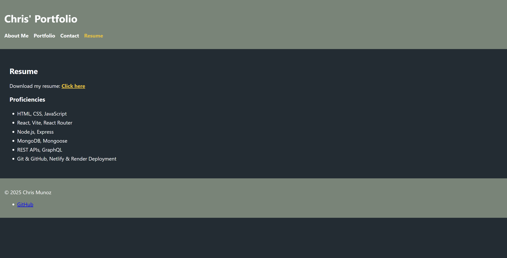

# React Portfolio

Welcome to my React Portfolio! This application showcases my web development projects using modern tools like React, Vite, and React Router. It features smooth navigation, clean design, and responsive layout with a custom dark theme.

##  Live Site

 [View Deployed Portfolio on Netlify](https://your-netlify-url.netlify.app)

##  ScreenShots

###  About Me

###  Portfolio

###  Contact

###  Resume

##  Technologies Used

- React
- Vite
- React Router DOM
- JavaScript (ES6+)
- Custom CSS
- Netlify (Deployment)

## Project Structure

- `About` section with bio and profile image
- `Portfolio` section showcasing 6 projects (images, live links, GitHub repos)
- `Contact` section with form validation and email display
- `Resume` section with downloadable PDF and list of proficiencies
- Reusable components: Header, Navigation, Footer, Project

##  Developer

**Chris Munoz**

-  Email: [chrismunozpro@email.com](chrismunozpro@gmail.com)
-  GitHub: [ Fadedsetton](https://github.com/FadedSetton)

##  License

MIT

---

